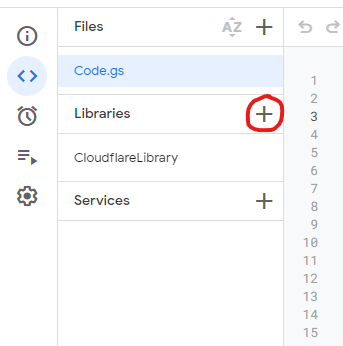

# Google Forms ➡️ Basecamp

## Overview

This project started out as a simple idea that we could use the "onsubmit" action on a Google form to trigger an update in Basecamp that would create a card detailing what needed to be done. Originally Westin had the idea for a few forms that the team was manually transferring information from Forms to Basecamp for, but the project became more complex than that in the end.

We now have the capability to create both todo list items and cards on the card table, and will soon have a feature to allow the connector to assign people to a card by default.

## Creating Connectors

### Setting up the environment

Thankfully the Google Apps Script environment has everything that you would need for making a device like this.
There aren't too many things you have to do to set up the new project. The most important thing is making sure that you have edit access to the form.
Without this edit access, you will not be able to create a script that will run on form submissions.

The next thing to do is to link the library that we created to facilitate easier creation of these connectors.



Once the dialog opens and you see the text box, enter `1klv2AvLhl7gGeBTJjItWbnLeKS5gRcg1jWXEpmchs27gKkBxV1gvlFaG` and press add.


The next step is to rename the function to a more informative name, such as `onSubmit` or `formSubmit`

Once the function is renamed, head over to the triggers tab, signified by the alarm clock in the left menu bar.

Click on the add trigger button in the bottom right corner.


A dialog similar to this one will pop up, prompting you to change some things to make sure that the function runs properly.

Change the function to run to be your newly created function and set the event type to be on form submit.


Press save and then you have your project all set up. You can now start to code the actual connector.

### Coding the connector

Head back to the code page and then copy and paste this code into the editor. This is a template for how to set up the connector.

```js
const postUrl = "https://forms-basecamp-link.creativesolutions.workers.dev/";
const locations = {
  SELECTOR_TEXT_1: "1234567890",
  SELECTOR_TEXT_2: "2345678901",
};

function onSubmit() {
  const formItems = CloudflareLibrary.getFormItems(FormApp.getActiveForm());
  console.log(formItems);
  const requestType = formItems["SECTION_SELECTOR"];
  let content = `
      <h3>Requester: ${formItems["NAME_FIELD"]}</h3>
      <h4>Cell phone: ${formItems["CELL_FIELD"]}</h4>
      <h4>Email: ${formItems["EMAIL_FIELD"]}</h4>
  `;

  switch (requestType) {
    case "SELECTOR_TEXT_1":
      content += `
        <h3>ITEM_1:</h3>
        <p>${formItems["ITEM_1"]}</p>
      `;
      break;
    case "SELECTOR_TEXT_2":
      content += `
        <h3>ITEM_2</h3>
        <p>${formItems["ITEM_2"]}</p>
      `;
      break;
    default:
      console.error("No request type selected");
      return;
  }

  const payload = {
    postUrl,
    type: "list", // or "card_table"
    projectId: "98765432",
    subId: locations[requestType], // or a constant value
    title: "TITLE_GOES_HERE",
    content,
    due_on: "", // defaults to a week in the future
  };

  CloudflareLibrary.sendDataToCloudflare(payload);
}
```

Take note that the formItems may have spaces after them, which need to be accounted for in the object.

This is the template for a multiple location todo list script, but can be easily modified for any other needs such as card tables or single destination forms.

Full HTML is supported so you can style using CSS and use any HTML tags that you want.
