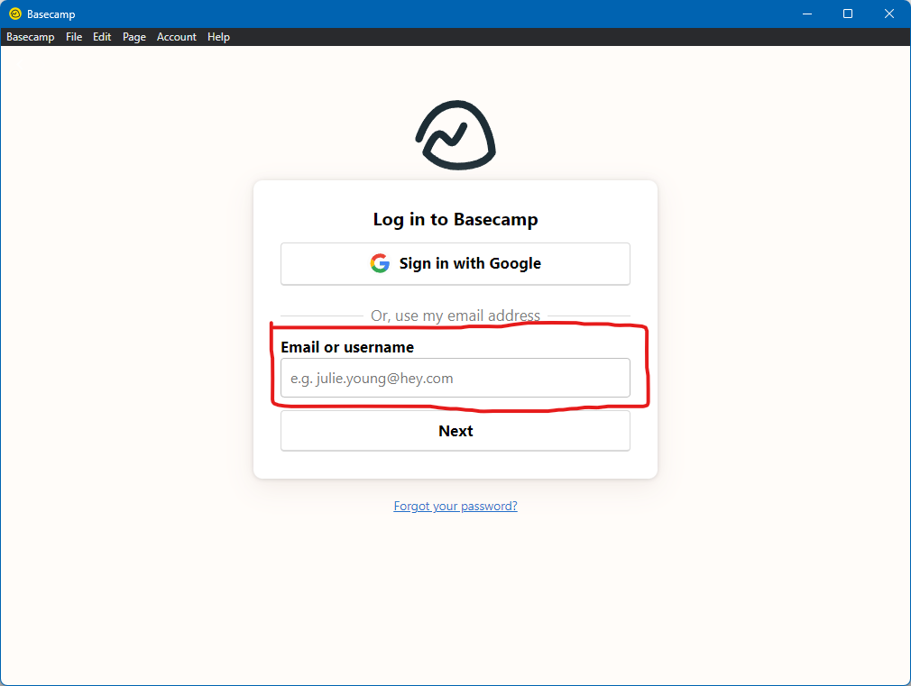
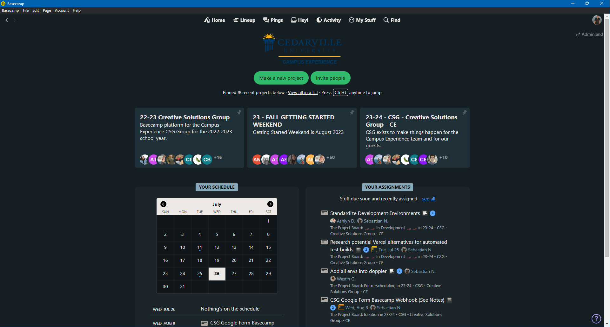
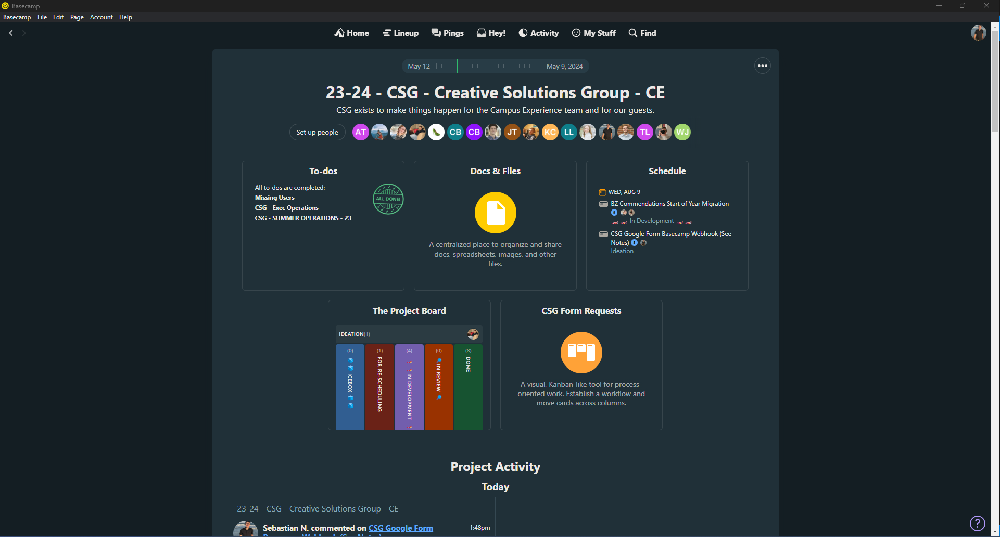
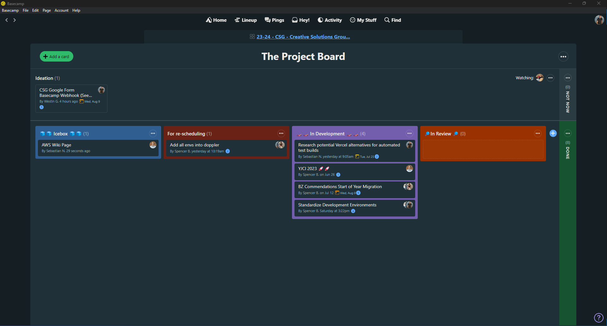
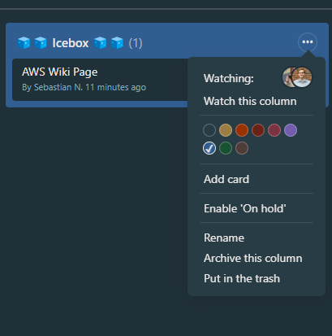
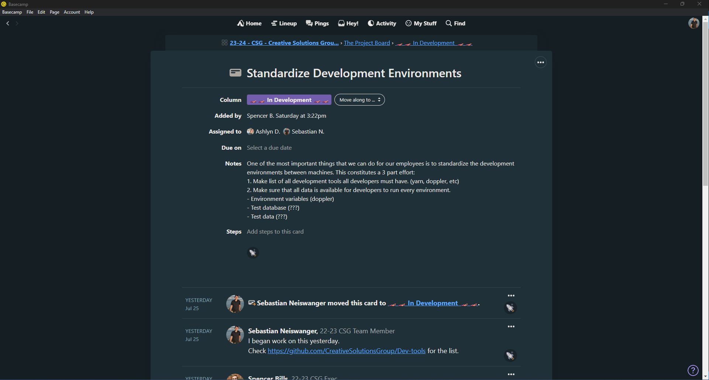

# Basecamp

[Home](../../Readme.md) / [Dev Tools](../dev-tools.md) / [Basecamp](tool.md)

This is our operational taskboard. It is used mainly by the executives on all CE teams. This will be used rarely by non-executive CSG members. It is similar to GitHub in the way it keeps track of tasks and their progress. You may log in to Basecamp from the website at [3.basecamp.com](https://3.basecamp.com/) if you do not want to install the application.

## Installation

### Desktop

1. Select either of the links below to download the Basecamp installer for your device.

2. Log in using your email. SSO does not work on this application, so it must be in the text field.

### Mobile

The mobile setup is very similar to the desktop install. Simply follow the steps using the buttons below.

## How to use

### Home page

This is your best friend. What you will need most is found here. The first strip of cards is the projects that you are a part of. Clicking one will bring you to a project page. On the **bottom left**, you will find a calendar with any assignments that have a due date. On the **bottom right** you will find all of your designated assignments. Your goal is to keep this as empty as possible. Clicking **See All** will show you all of your assignments on a separate page.

### Project page

On a project page, you will see a few different options. Most commonly there is **to-dos**, **docs & files**, **schedule**, and then different boards. The picture includes **The Project Board** and **CSG Form Requests**. **To-dos** are a list of assignments that need done. **Docs & Files** are an easy place for storing files that are to be shared on cards. **Schedule** is a calendar of any assignments with due dates. At the bottom, you can see a timeline of all activity that has been done within the project.

### Project Boards

This page includes most of the assignments made for the project. In this example, we have 6 sections. **Ideation** for an assignment not yet ready to be worked on yet (think draft stage). **Icebox** is for any tasks that are ready for work but haven't been started yet. **For re-scheduling** is for tasks that may have been started, but need to wait or be scheduled again (this is *not optimal*). **In Development** are any tasks that are being worked on in some capacity. **In Review** are for any tasks that are *done* by the assignee, but need to be looked at by a higher-up before being affirmed complete. Finally, **done** is for those tasks that are truly finished.

### Creating a task / assignment / card

Creating a task can be done easily. While inside a project board, click any of the ellipses inside a circle. Then select **Add card**. This will open a dialog where you can fill in the information pertaining to the task and save it.

### Assignments

By clicking on an assignment you can open up its assignment page. This includes any information on the task, as well as any conversation pertaining to it. Any of the task information can be altered. Whenever work is done on an assignment, a message should be sent to inform anyone else working on it. To tag a specific person in a message, you can type their name proceeded by an `@`. This will *ping* them.

## FAQ

*Will I need this?*

*How do I setup 2 Factor Authentication?*
