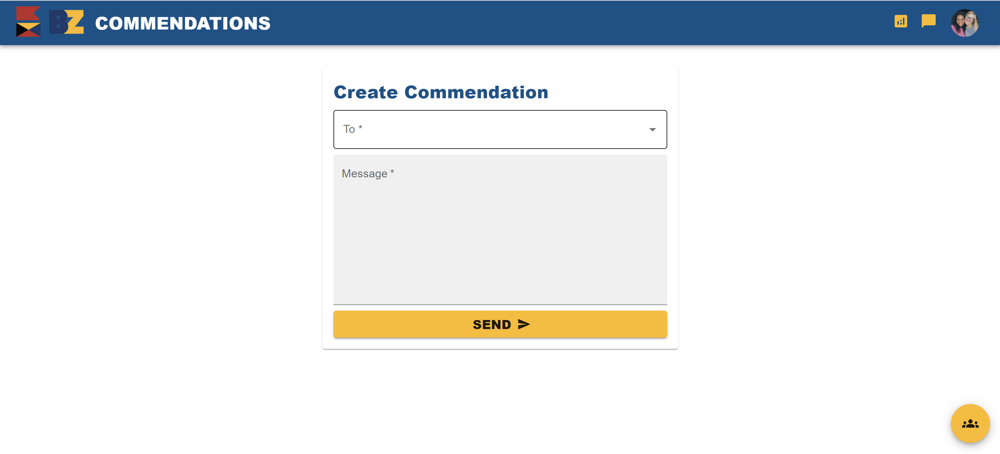

# BZ Commendations

[Home](../../Readme.md) / [Dev Tools](../dev-tools.md) / [BZ Commendations](tool.md)

"The combination of the Bravo and Zulu nautical signal flags, i.e., Bravo Zulu, also referred to as '**BZ**,' is a naval signal, typically conveyed by flaghoist or voice radio, meaning '**Well Done**' with regard to actions, operations or performance." 

[Read More](https://en.wikipedia.org/wiki/Bravo_Zulu#:~:text=The%20combination%20of%20the%20Bravo,to%20actions%2C%20operations%20or%20performance.)

## Prod Perspective

From a production perspective, [BZ Commendations](https://bz-cedarville.com/) is a platform used by all CE members and staff to foster encouragement and excellence by intentionally seeking to commend jobs **well done**. Commendations can be sent to individuals or collectively to a [team](https://bz-cedarville.com/team). There is also an [admin dashboard](https://bz-cedarville.com/admin), and a space to view your sent and received commendations.

## Dev Perspective

From a development perspective, [BZ Commendations](https://github.com/CreativeSolutionsGroup/bz-commendations-next) is an application built and maintained by CSG.

Every new academic year, the database of CE members must be updated. To insert a new member, his/her name, email, and (preferably) phone number is needed. All old members will be deleted as well as the past year's commendations. The script currently being used to accomplish these tasks can be accessed [here](https://github.com/CreativeSolutionsGroup/utils/tree/main/).
