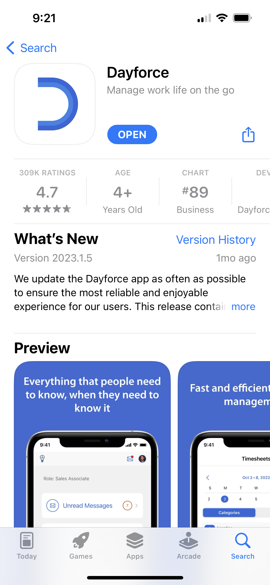
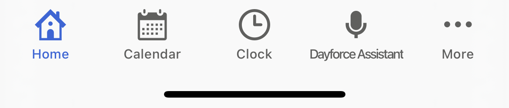
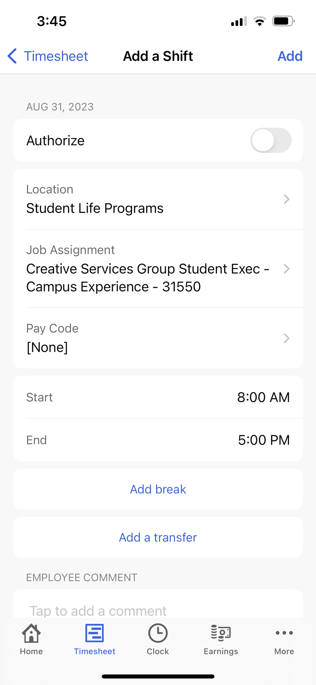
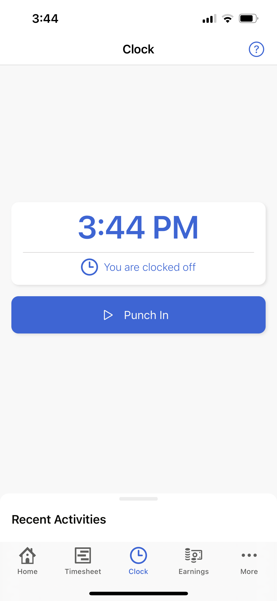

# Dayforce

[Home](../../Readme.md) / [Dev Tools](../dev-tools.md) / [Dayforce](tool.md)

This is the payroll application used by Cedarville University. It is how you clock your hours, and thus get paid. Remember that unless you are told otherwise, you are allotted 10 hours a week to work (this is a limit, not a requirement).

## Installation

We recommend installing Dayforce on mobile so you can feasibly clock in and out as you work. This wiki provides information on Dayforce mobile only.

Go to your local Google Play (Android) or App Store (Apple) and type in `Dayforce`. The correct application appears as follows:

### Login

1. Company code: `cedarville`
2. SSO (Single-Sign-On) with Cedarville credentials

## How to use

### Navigation

The bottom bar will be your main source of navigation. 

It can be customized by clicking the `...` labeled `More`. This will bring you to the following page:

Click `edit`, in the top right corner. Hold and drag the tabs you would like to appear in your navigation bar into the `FAVORITE TABS` section. The rest of the tabs (the ones remaining in `FEATURES`), will still be accessible, but only through `More`.

We recommend `Home`, `Timesheet`, `Clock`, and `Earnings` for your `FAVORITE TABS` (you are limited to four). These will be the tabs you use most often. Click `save`, located in the top right corner.

If you click `Done`, your favorited tabs should now appear in your navigation bar.

### Timesheet

Click the `Timesheet` tab.

Pay periods are every two weeks. You will see the current pay period in the header, as well as your current `Total hours` worked, and navigation arrows to view past and future pay periods. While we recommend manually clocking your hours (see section below), you can add shifts manually by clicking the `...` that appear next to each day. 

A screen should appear similar to the following:

Despite the amount of information presented, the process of recording a shift is fairly straight forward. 
1. Toggle `Authorize`. This is a non-verbal commitment that the hours you are recording are accurate, to the best of your ability. This saves Accounting an immense amount of time as *all* non-authorized shifts have to be manually authorized by them.  
2. As a member of CSG, your `Location` should be `Student Life Programs` and your `Job Assignment`, `Creative Services Group Student [Exec]`. If you are not an executive, the `Exec` tag will be absent. If you have another job on campus other than CSG, click the `>` for either `Location` if it is *not* affiliated with `Student Life Programs` (the `Job Assignment` should automatically populate if you have only one job in that secondary `Location`), or `Job Assignment` if it is. 
3. Enter your `Start` and `End` time and any breaks in the `Add break` section, if applicable.
4. Click `Add`, in the top right corner.

You should ensure the shift correctly populated on your timesheet. Your `Total hours` should increase.

**If you have multiple jobs, make sure you are always logging your hours under the correct `Job Assignment`.**

### Clock

Click the `Clock` tab.

Clocking your hours is the recommended way to record your time. Simply press `Clock in` when you begin work. After clicking, the button will read `Clock out`. Press the button again when you are finished with your shift or are taking a break (remember to clock back in when you are finished). 

Because manually clocking does not have an authorize button, you should go into your `Timesheet` before the end of each pay period, click the top right `...`, and select `Authorize`.

### Earnings

Click the `Earnings` tab.

This is where you are able to see your payments for each pay period. You can click on a specific period and you will be presented with a `Summary` `Preview` toggle. Here you can view your net pay, taxes, and your direct deposit information.

For setting up your direct deposit see the [Dayforce Wallet](../dayforce-wallet/tool.md) section.

## FAQ

*How many hours should I work?*
> As a non-executive, you are not required to work a minimum number of hours per week. You are, however, allotted a maximum of 10 hours per week, and 20 hours a pay period (every 2 weeks). This may change if given direct orders from a CSG executive, Westin, or Brian.
> As a member of CSG, however, you are expected to attend the weekly Sprint Meeting. You may clock this (half-)hour.

*I can't log in. What should I do?*
> If you are a new-hire at Cedarville, HR has likely not finished filling or is missing some of the paperwork necessary to begin clocking hours. Email [cuhired@cedarville.edu](mailto:`cuhired@cedarville.edu`) explaining the situation.
> If this is a "random" occurance, try closing out of the app and re-opening it. Make sure you are using SSO.

*When will I be able to log my hours?*
> As a non-executive, you will be allowed to begin clocking hours at the start of Getting Started Weekend (this will be a Friday in August).
> As an executive, you will be allowed to clock hours as soon as executive training begins.

*I forgot to log my time. What should I do?*
> Contact your group leader as soon as possible! They will direct you on what to do dependent on whether the time to be logged is from a present or past pay period (once a pay period has ended you cannot edit your hours worked). Record your hours in either your phone or on a piece of paper until the issue can be resolved. 