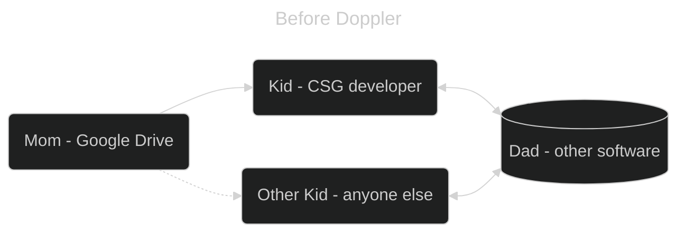
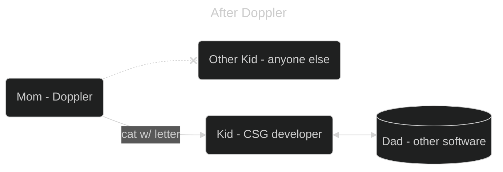
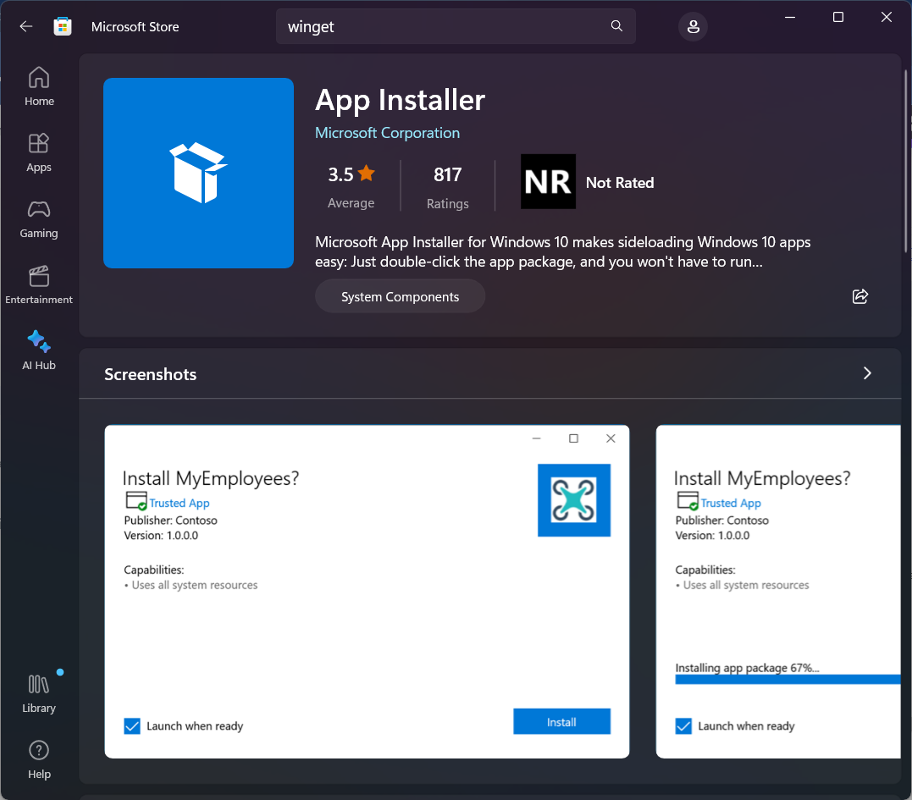

# Doppler

[Home](../../Readme.md) / [Dev Tools](../dev-tools.md) / [Doppler](tool.md)

Welcome to the wonderful world of Doppler. Doppler is the SecretOps tool that we use. It holds onto all of our environment variables and allows easy access to them while still being secure. 

As an analogy from Westin puts it this way. Before we used Google Drive which forced everyone to copy and paste all env files. We gave our mom (Google Drive) our secrets, but when her kid (CSG developers) wanted to use the secret with dad, she just shouted it out. There could have been another kid (anyone on the internet) that tried listening from the street and so far we have just gotten lucky that it hasn't happened yet. With our databases this means that they could have gotten all student info on campus



Now with Doppler, when a kid wants to talk to Dad, they must first request the secret from mom. Mom covertly sends the secret to the Kid in a sealed letter riding atop a cat. The kid cannot open the letter but can give it to Dad to start talking to him. In this scenario the other kid would have to capture the cat and find a way to open the letter before being able to talk to dad.



## Installation

### Windows

1. Download Winget from the microsoft store.
   1. Open the `Microsoft Store` app on your computer
   2. Search for `winget`
   3. Install the app shown below if it hasn't been yet



2. Open a powershell window in administrator mode.
3. Run `winget install doppler`
4. Run `doppler --version` to ensure that doppler is installed.

### Mac

1. Open a terminal
2. Install Homebrew

```shell
export HOMEBREW_BREW_GIT_REMOTE="..."  # put your Git mirror of Homebrew/brew here
export HOMEBREW_CORE_GIT_REMOTE="..."  # put your Git mirror of Homebrew/homebrew-core here
/bin/bash -c "$(curl -fsSL https://raw.githubusercontent.com/Homebrew/install/master/install.sh)"
```

3. Sorry I can't instruct anymore on Homebrew installation, as I don't have a mac to test.
4. Run `brew install gnupg` and then `brew install dopplerhq/cli/doppler`
5. Run `doppler --version` to ensure that doppler is installed.

### Linux (Debian 11+ / Ubuntu 22.04+)

```shell
sudo apt-get update && sudo apt-get install -y apt-transport-https ca-certificates curl gnupg
curl -sLf --retry 3 --tlsv1.2 --proto "=https" 'https://packages.doppler.com/public/cli/gpg.DE2A7741A397C129.key' | sudo gpg --dearmor -o /usr/share/keyrings/doppler-archive-keyring.gpg
echo "deb [signed-by=/usr/share/keyrings/doppler-archive-keyring.gpg] https://packages.doppler.com/public/cli/deb/debian any-version main" | sudo tee /etc/apt/sources.list.d/doppler-cli.list
sudo apt-get update && sudo apt-get install doppler
```

After that run `doppler --version` to ensure that doppler is installed.

## How to use

### Authentication

When logging in you will want to use your Cedarville account. You should have received an email invitation from Doppler to join our group. If you have not accepted the invitation please do.

1. Open your terminal and run `doppler login`
2. This should open a web window prompting you to login
3. After logging in go back to your terminal, and it should ask if you want to use it as a global login or for your workspace (it just means your directories branching from the one you are in currently). Choose whichever option applies.

### Project Setup

1. Open a terminal and navigate to the directory containing the project. You may do this by opening a terminal within VSCode.
2. Run `doppler setup`
3. Select the project that you are working in, and then press enter
4. Select the `dev` config, and press enter

### Running commands

The default command for anything now will have `doppler run &&` attached to the front of it. Doppler needs to give you the secrets before you can do things like run the application or access prisma. Here a few examples of popular commands

- `doppler run && prisma studio`
- `doppler run && next dev`
  - This one in particular may be different. Within the `package.json` we are able to setup commands that run a different set of commands. For instance, in most project we setup `yarn dev` to run `next dev`. After adding doppler to the project `yarn dev` will likely run the doppler part as well.

### Updating

Updating doppler is very easy. Just run `doppler update` and it should properly update for you.

## FAQ
