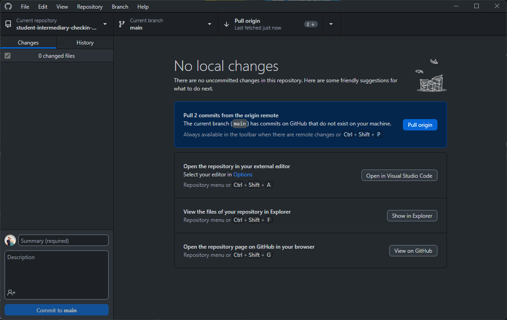
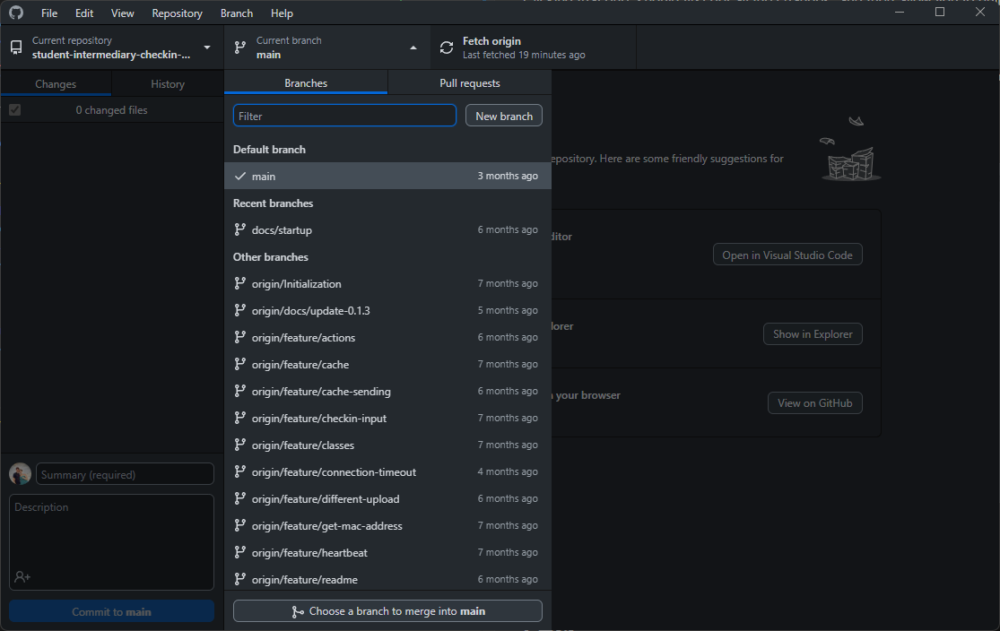

# GitHub Desktop

[Home](../../Readme.md) / [Dev Tools](../dev-tools.md) / [GitHub Desktop](tool.md)

GitHub Desktop is a GUI desktop interface for utilizing Git. It is not required if you know or like to use the command line. This is mainly for those new at using Git as the commands can be hard to remember at first.

## Installation

Select one of the install buttons to install the application.

You will likely have to sign into your GitHub account at this point. If you don't have one you can follow the step [here](../github/tool.md#github-account-creation).

## How to use

### Cloning a repo

Cloning a repo is a necessary first step to work on any repo. It is the act of creating a local copy of the repo on your personal device, that mirrors the repo found on GitHub. You can do this in a few ways. One way is utilizing the [terminal/shell](../github/tool.md#cloning-a-repo) and the instructions for that can be found on that page.

1. From the home page select the `Change Repository` tab.

2. From there select the `Add` button.

3. Then select `Clone repository...`.

4. From there it is recommended that you Filter with `Creative` and select the repo. You may also need to adjust your local path if you haven't done so. Then select `Clone` and you are done.

If you could not find anything by searching you will need to do a few more steps. 

1. Go to the repo from our [organization page](https://github.com/CreativeSolutionsGroup).
2. Click on the `Code` button as seen below.

3. Select the `Open with GitHub Desktop` button. You may need to allow the website to open the application.
4. It will open a clone window for you. All you need to do now is make sure the local path leads to where you want it and click `Clone`.

### Working on a repo

This comprises all the steps of working on a repo. These will be in order if you are just starting work for the day with no branch.

#### Selecting a task

1. Navigate to our [project Kanban board](https://github.com/orgs/CreativeSolutionsGroup/projects/9).
2. From here select one of the items in the `Todo` section that you have been assigned to.
3. Move the task into the `In Progress` column.
4. From here you can click `Open in new tab` on the right side.
5. Now you want to create a new branch associated with your work by clicking on the link under `Development` labeled `Create a branch`.
6. You will want to change the branch name.
    - We use a few different prefaces for different reasons.
        - `feature` is our main preface that denotes the changes as mostly new items that add to the application.
        - `fix` is for when you are working purely on fixing bugs.
        - `update` is uncommon, but for when you are just updating dependencies.
    - After the preface add a `/`.
    - Then describe what the task is in as few characters as possible.
    - For example, I would consider the branch that I am working on creating this GitHub page, `feature/github-desktop-page`.
7. You can then select `checkout locally` or `open branch with GitHub desktop`, and click `Create branch`.
8. You are now good to [switch to the branch](#switching-branches).

#### Getting all changes from GitHub

All you have to do to get the new changes is press the button along the top that says `Pull origin`. If you don't see that or a number like the `2`, there should be a different button in its place labeled `Fetch origin`. Clicking that one, should first get all the changes, and then allow you to pull properly.

#### Creating a branch

You should have created a branch when you [selected a task](#selecting-a-task), however, if you need to create a new one after just follow these steps.

1. Check that you are on the `main` branch before continuing. If you are not you will end up creating a branch off of an offshoot that may be behind. You can switch branches by following the [instructions found here](#switching-branches).
2. Make sure your local branch is up to date. You can find those [instructions here](#getting-all-changes-from-github).
3. Select the `current branch` button from the top middle.

4. Select the `New branch` button.

5. Make sure once again that you are on the `main` branch. From there enter give it a name following the scheme [found above](#selecting-a-task).

6. Click `Create branch`.

#### Switching branches

1. Make sure you have no current changed files. If you have any you need to first commit or remove the files by following the steps from [here](#committing-changes).
2. Select the `Current branch` button from the top.

3. Select the target branch from the list.

4. You should be done, but if you can't find the branch follow the steps [here](#getting-all-changes-from-github) to get all changes from GitHub.

#### Committing changes

When you need to save your changes back to GitHub you can follow these steps. But if you need to remove the changes follow the second set of steps below.

1. Make sure that all the changes you made show up. They should appear as they do below, as either added files, changed files, or removed files. Clicking any of the file names will attempt to show the changes on the right side.

2. As long as everything is good, type a message in the summary box as a small explanation for all the changes.
3. Click the `Commit to <BRANCH NAME>` button. Keep in mind that you should **NEVER** commit to `main`. It is purely used as an example here.

Now for removing:

- If you are removing all changes, then `right click` the bar that numbers the changes. Then click the `Discard all changes...` button. Keep in mind that this will not be deleting all files, just removing the local changes you made.

- If you need to remove a single file change `right click` on that file and select `Discard changes...`.

## FAQ

*Can't find the repo?*
>
>
>When you ecnounter this problem it is likely because you moved the repo to another location. Just select the `Locate...` button and find the repo again. Once found select the `Select Folder` button. Everything will be all fixed at that point.
