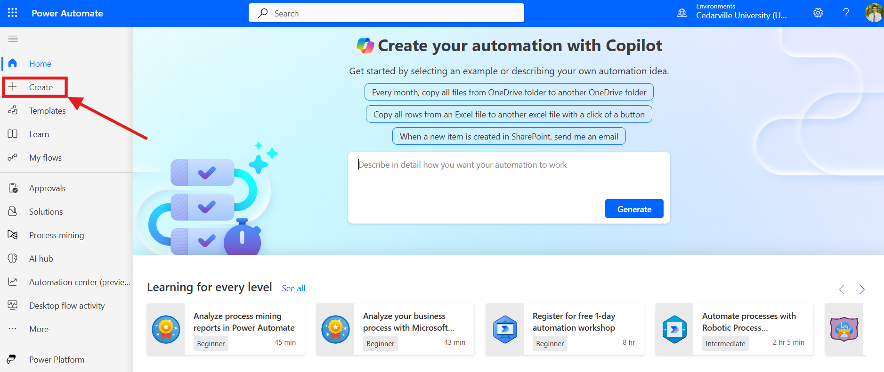
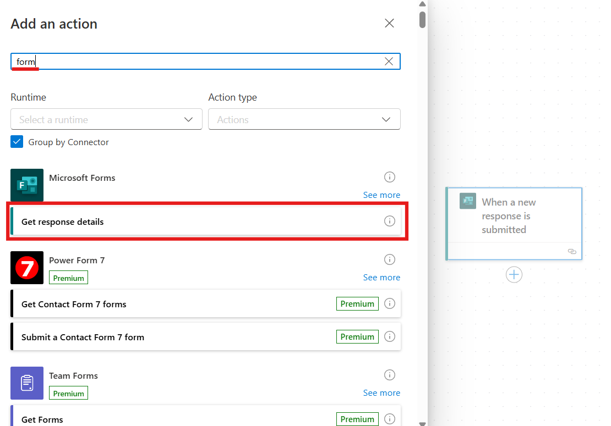

# Microsoft Forms ➡️ Basecamp

## Overview

This document serves as a tutorial to setup a connecter between Microsoft Forms and Basecamp using Power Automate. You can think of this as what webhooks used to be with Google forms now in the context of Microsoft forms.
Creating a card in Basecamp is a two-step process involving the Power Automate script (instructions to follow) to create a to-do list item. Since Power Automate can only create these to-do list items, we also need a backend to parse the data from the to-do and create a card with the information, which is outside the scope of this particular wiki entry.

## Creating Connectors

### Setting Up the Flow

Firstly, navigate to make.powerautomate.com. On the lefthand side of the screen, click create. Under "start from blank", click "Automated cloud flow".



   

Give the flow an appropriate name and select "When a new response is submitted" as the trigger.

  

Navigate over to the Microsoft form that the flow is connecting to Basecamp and copy the `id=` field in the URL.

   

In the newly created flow, click on the "When a new response is submitted" item. In the pane that appears on the lefthand side, select the "Form Id" blank and click "Enter custom value". Paste in the blank the ID copied from the form URL.

   

Add an action using the '+' button underneath the currently selected object in the flow. In the side pane, search for "get response details" and choose the option under "Microsoft Forms".

 
<br>  


Click the newly inserted item and in the pane, paste the Form Id in the blank as done previously. Select on the "Response Id" field and click the lightning bolt icon that appears on the right of the blank. In this menu, select the "Response Id" option.


<br>

<br>

<br>
   

Add another action under the "Get response details", this time searching for "basecamp". Select "Create a to-do" under "Basecamp 3".

   
<br>

<br>
   

Click on the "Create a to-do" item in the flow and sign into Basecamp.

### Formatting the to-do

**IMPORTANT**: For the following section, any time a form response item must be referenced, click the "fx" icon under the lightning bolt to the right of the blank, click on Dynamic Content, and then select the form item needed. **Otherwise, the content will not populate and the to-do list item will be empty in Basecamp!** An example of using this "fx" menu is shown below.


<br>


The "Content" field represents the title of the card item. This should be something like "[name] submitted a [service] request", though titles may change depending on circumstance of the form.


The "Account Id" field is the Basecamp account Id. Select "Campus Experience at Cedarville University" from the dropdown.


The "Basecamp" field is for the specific Basecamp under Campus Experience where the to-do list item will appear. Select "24-25 Creative Solutions Group - CE" from the dropdown.


The "To-Do List" field is for the to-do list that the flow will send to. Select "Webhooks Temporary Holding" from the dropdown.


The "Description" field is where all the content of the card item will be. This should contain all questions and response items from the form, which may require unique formatting, in HTML. Provided below is an example written for a test flow:


Note again that all the form response items were selected through the "fx" menu under Dynamic Content.

Below is templated code for the Description field. Be sure to replace the `<TARGET_PROJECT_ID>` field with the number after `bucket/` in the URL of the destination Basecamp, as well as the `<TARGET_COLUMN_ID>` with the `todolists/` number in the URL of the destination Basecamp. Replace `<TODO_ITEM_TITLE>` with the desired title on the final card item. Replace `<HTML_DESCRIPTION>` with an HTML representation of what is desired in the final card item's description field.

```json
{  
"title": "<TODO_ITEM_TITLE>",
"project_id": "<TARGET_PROJECT_ID>",   
"column_id": "<TARGET_COLUMN_ID>",  
"content": "  
<HTML_DESCRIPTION>
"  
}
```

### Finishing Up
To deploy your Power Automate script, all you have to do is save the script using the save button in the upper left hand corner. You should receive a notification telling you that it was saved, and prompting you to test it out.
Congratulations, you created a Power Automate script!

