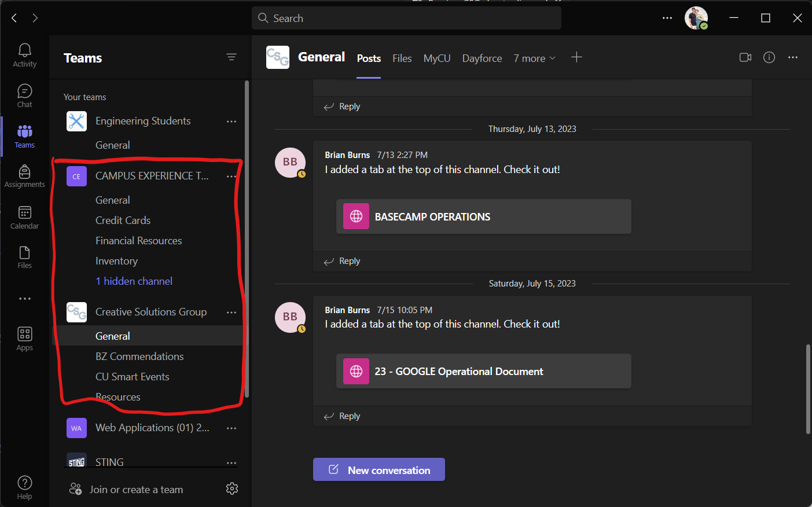
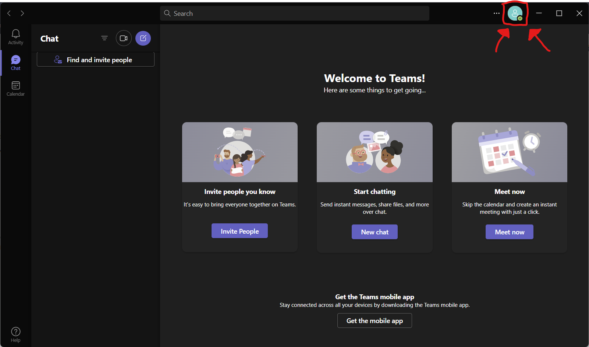
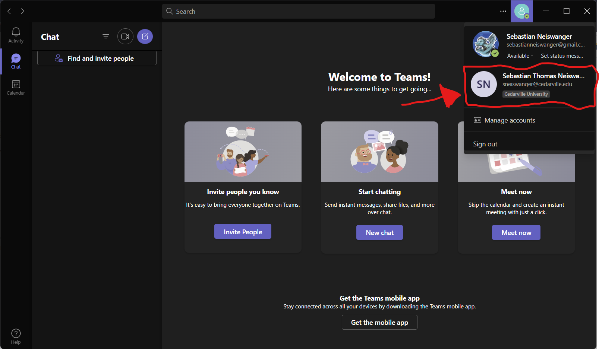
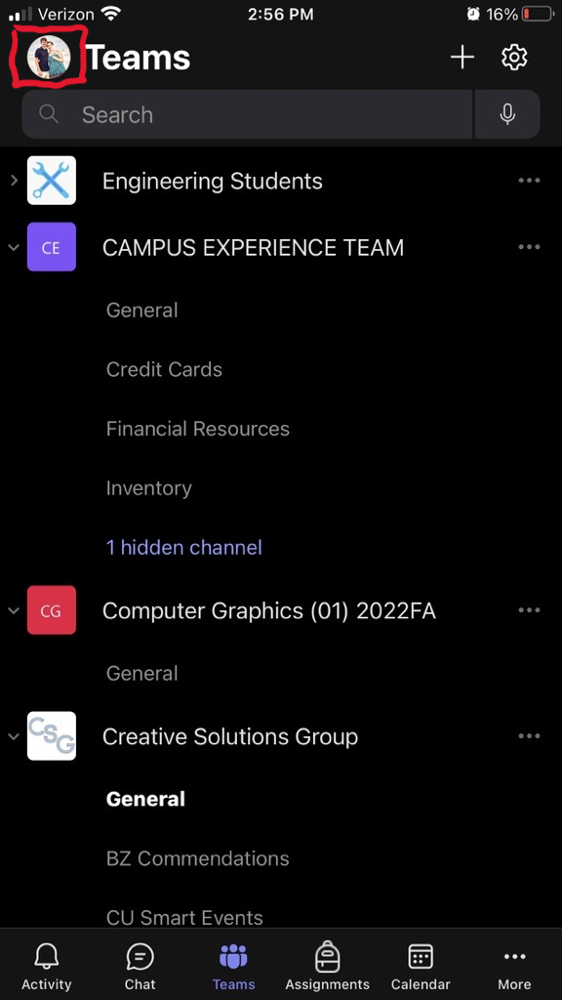

# Microsoft Teams

[Home](../../Readme.md) / [Dev Tools](../dev-tools.md) / [Teams](tool.md)

This is a communication app used by CE as a whole. Any work communication should be done on Teams. There are two applications, mobile (for your phone) and desktop (for your computer). You will **not** be forced to install either application, but if you are working you must have access to Teams. If you do not want either application you need to be able to access the website at [teams.microsoft.com](https://teams.microsoft.com).

## Installation

### Desktop

1. Download the installer from [here](https://go.microsoft.com/fwlink/?linkid=2187327&Lmsrc=groupChatMarketingPageWeb&Cmpid=directDownloadWin64&clcid=0x409&culture=en-us&country=us)
2. Run the installer
3. Login to your Cedarville account

### Mobile

1. Download the Apple or Android App from [here](https://aka.ms/teamsmobiledownload), or scan the QR Code.

2. Login to your Cedarville account

## How to use

Due to the app being used by all CE, each member will belong to different Team spaced. As a general rule, all should have the two teams shown in the picture below.

Any group-related messages will come through these two teams. Check them often if you ever want the chance at free donuts!

Most of the messaging you will participate in will be in the **Chat** tab. In this tab, you will be able to select specific people to message. This is best used for sub-groups or if you need to get ahold of a specific individual. All work-related messages should be sent using Teams.

## FAQ

*Why Can't I see the CSG team on desktop?*

> 1. Click the profile button up at the top right of the window.
>
> 
>
> 2. Select the profile that is linked to your Cedarville email.
>
> 
>
> 3. It should open a new window with your selected account.
> 4. Select the **Teams** tab from the left sidebar.
> 5. If you still do not see the team listed on the left, please contact one of your executives.

*Why can't I see the CSG team on mobile?*

> 1. Click the profile button at the top left of the app.
>
> 
>
> 2. Select the profile that is linked to your Cedarville email.
> 3. If you do not see your Cedarville account click the add account button and sign in.
>
> 
>
> 4. It should reopen the app with your newly logged-in account.
> 5. Select the **Teams** tab from the bottom bar.
> 6. If you still do not see the team listed on the left, please contact one of your executives.

*Do I need to have Teams?*
> You will be required to have access to Teams. Whether that be through mobile, desktop, or Microsoft Teams's website is entirely up to you. Quick and consistent communication is always encouraged, but turning on notifications for Teams is not required by non-executives. Due to Teams being a work-only messaging app, you will not recieve unnecessary or copious amounts of messages.
