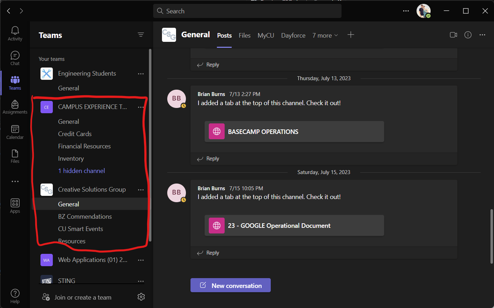
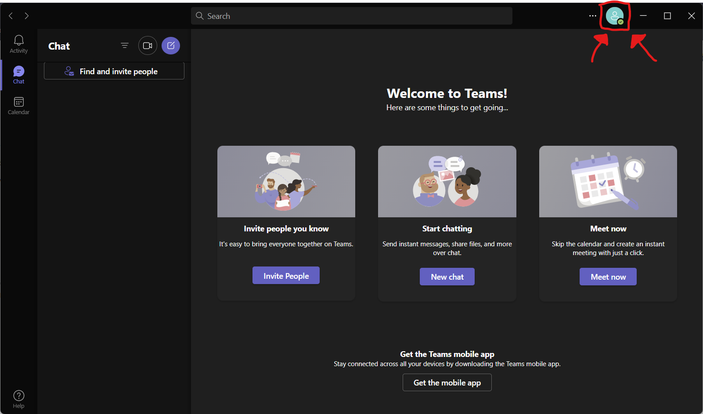
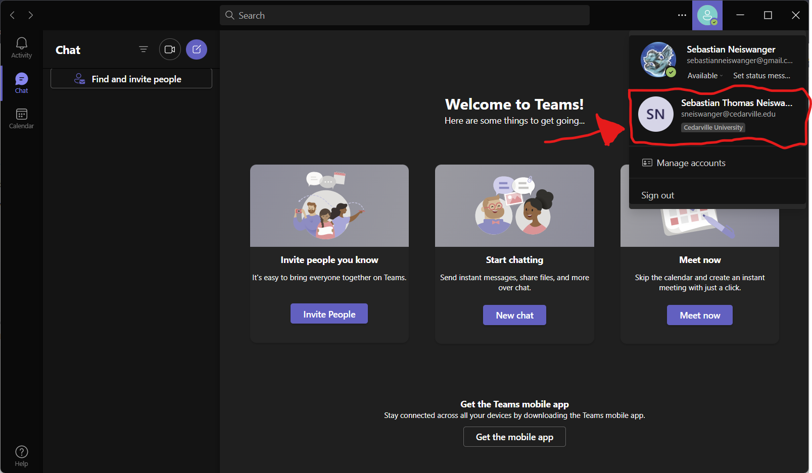
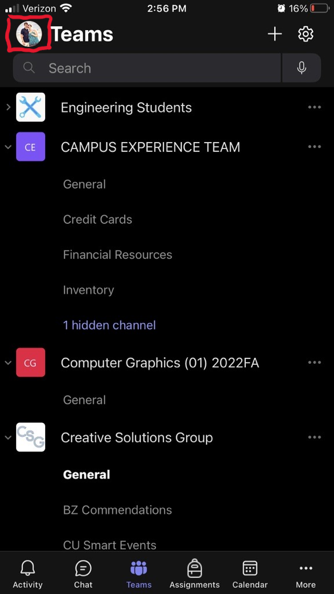

# Microsoft Teams

[Home](../../Readme.md) / [Dev Tools](../dev-tools.md) / [Teams](teams.md)

This is a communication app that is used by Campus Experience as a whole. Any work communication should be done on teams. There are two applications, one for phone and one for computer. You will **not** be forced to install either application, but if you are working you must have access to Teams. If you do not want either application you need to be able to access the [teams website](https://teams.microsoft.com/go#).

## Installation

### Desktop

1. Download the installer from [here](https://go.microsoft.com/fwlink/?linkid=2187327&Lmsrc=groupChatMarketingPageWeb&Cmpid=directDownloadWin64&clcid=0x409&culture=en-us&country=us)
2. Run the installer
3. log in to your Cedarville account

### Mobile

1. Download the Apple app or the Android App from [here](https://aka.ms/teamsmobiledownload) or scan the QR Code.
 

2. log in to your Cedarville account

## How to use

As this is a messaging app it is going to be used differently by everyone. As a basic rule, you should have the two teams shown in the picture below.

Any group-related messages will come through these two groups. Check them often if you ever want the chance at free donuts.

Most of the messaging that you will care about will be in the **Chat** tab. In this tab, you will be able to select specific people to message. This is best used for sub-groups or if you need to get ahold of a single person. Other than that the app works the same as a text messaging app, just for work purposes. Any work-related messages should be done on teams.

## FAQ

*Why Can't I see the CSG team on desktop?*
> 1. Click the profile button up at the top right of the window.
> 
> 
> 
> 2. Select the profile that is linked to your Cedarville email.
> 
> 
>
> 3. It should open a new window with your selected account.
> 4. Select the **Teams** tab from the left sidebar.
> 5. If you still do not see the teams listed on the left, please contact one of your execs.

*Why can't I see the CSG team on mobile?*
> 1. Click the profile button at the top left of the app.
>    
> 
> 
> 2. Select the profile that is linked to your Cedarville email.
> 3. If you do not see your Cedarville account click the add account button and sign in.
>
> 
>
> 4. It should reopen the app with your newly logged-in account.
> 5. Select the **Teams** tab from the bottom bar.
> 6. If you still do not see the teams listed on the left, please contact one of your execs.

*Do I need to have Teams?*
> You will be required to have access to Teams at the lowest location (At least the website). Unless you are an exec, team members need not have access to Teams at all times. It is however, nice to be able to respond to a quick question, and we as execs on CSG, will not blow up your phone with nonsense messages.
