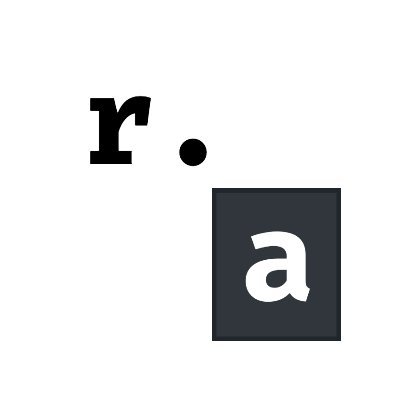

# rust-analyzer

rust-analyzer is a VSCode extension that allows for type completion and error checking within Rust files.

## Installation

Search for `rust-analyzer` in the VSCode Extensions tab and install it.

## How to use

It will now automatically run within Rust files, and give alerts when it finds errors or warnings.
