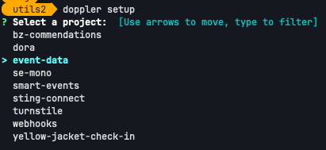
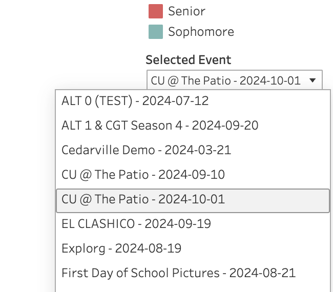
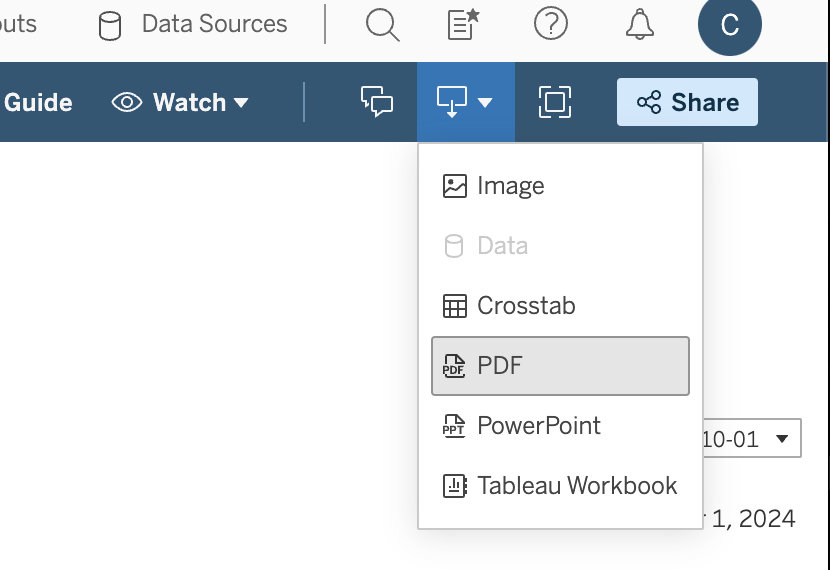

# Reporting

How to create a report using Tableau and iAttended

## Requirements

* Access to Tableau in either the desktop or web versions.
* The [utils](https://github.com/CreativeSolutionsGroup/utils) repository cloned to your machine.
* Python 3.12 installed on your machine

## First Time Setup

1. Set up Doppler for the utils directory and choose `event-data`. Selecting dev and prod environments both work identically.

2. Change directory into the `iattend` directory.

3. Create a virtual environment with Python. See [the documentation](https://docs.python.org/3/library/venv.html) for more details.

4. ENSURE your venv is activated. Google this for your platform.

5. Install the requirements `pip install -r requirements.txt`

6. Generate the Prisma client `python -m prisma generate`

## The Process

1. Start the script `doppler run -- python3 main.py`

2. Update events by selecting that option from the menu

3. Enter into the `Update Attendees` submenu

4. Select the event for which you are generating the report

5. Once the script has finished running exit by selecting that menu option

6. Open the Tableau [dashboard](https://prod-useast-a.online.tableau.com/#/site/cedarvilleuniversity/views/EventReports/Dashboard)

7. Select the event for the report from the dropdown menu

8. Use the download button located in the top right to download the file

9. Upload the report to the [YJCI Google Drive](https://drive.google.com/drive/u/0/folders/1QKL6ZSws_5dqf7qxv7gWyZNhSyxpE_So)

10. Communicate that the report is finished to execs