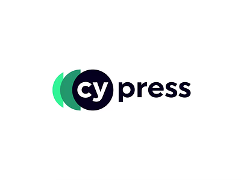

# Cypress

[Home](../../Readme.md) / [Unit Testing](../unit-testing.md) / [Cypress](cypress.md)

Cypress is a front end testing tool built for the modern web. It can test anything that runs in a browser, therefore enabling E2E, component, integration, and unit tests to be written. Cypress is a free, open-source, and locally installed application (with an abundance of [features](https://docs.cypress.io/guides/overview/why-cypress#Features)). It runs as fast as your browser can render content; therefor, you can watch tests run in real time as you develop your applications. Cypress can perform arbitrary HTTP calls, thus it can be used for API testing.

Consider:
- [**Caveat** when using Cypress w/ Next.js](https://docs.cypress.io/guides/component-testing/react/overview#Nextjs-Caveats)
- [E2E vs component testing: an overview](https://docs.cypress.io/guides/core-concepts/testing-types#Testing-Type-Comparison)

## Setup

1. Install the Cypress package through *either* `npm` or `yarn`:
    - `npm install --save-dev cypress`
    - `yarn add cypress --dev`
2. Add Cypress to the `package.json` scripts field *only if* using `npm`: 
```
{
  "scripts": {
    "dev": "next dev",
    "build": "next build",
    "start": "next start",
    "cypress": "cypress open"
  }
}
```
3. Run Cypress through *either* `npm` or `yarn`: 
    - `npm run cypress`
    - `yarn run cypress open`

There are no servers, drivers, or any other dependencies to install or configure.

## Cypress Cloud

With [Cypress Cloud](https://docs.cypress.io/guides/cloud/introduction), your test runs can be recorded.

### Sources

All information under directory `Unit-Testing` can be attributed to the following sources:
- [Optimizing: Testing | Next.js](https://nextjs.org/docs/pages/building-your-application/optimizing/testing)
- [Why Cypress? | Cypress Documentation](https://docs.cypress.io/guides/overview/why-cypress)