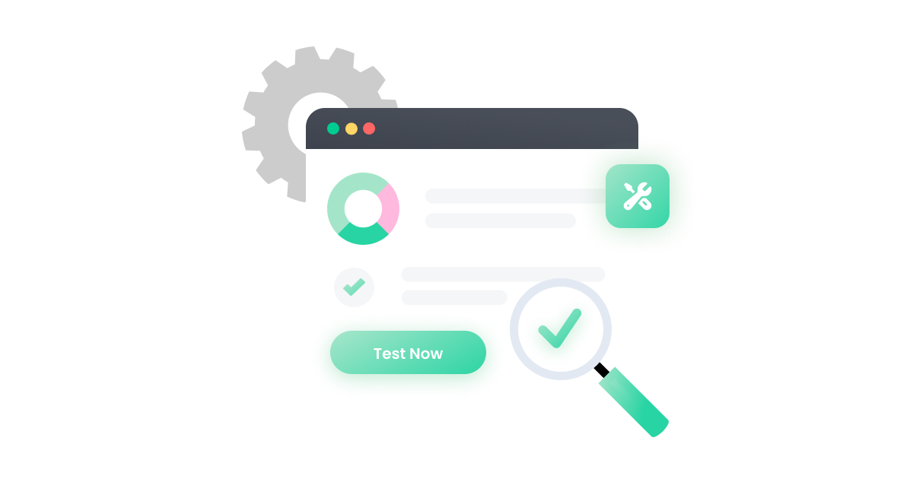

# Component

[Home](../../../Readme.md) / [Unit Testing](../../unit-testing.md) / [Cypress](../cypress.md) / [Component](tool.md)

Components are logical units of an application that range in size from fairly small (like a button) to more complex (like a registration form). A component can be "mounted" and tested on its own, allows you to focus on testing only the component's functionality and not worrying about other nuances with testing a component as part of the larger application. **Caution**: even if all your component tests pass, it does not mean your app is functioning properly. Component tests do nothing to ensure that all the layers of your app are working well together. 

- [Benefits](https://docs.cypress.io/guides/core-concepts/testing-types#Benefits-of-component-tests)
- [Considerations](https://docs.cypress.io/guides/core-concepts/testing-types#Considerations-for-component-tests)
- [Common senarios](https://docs.cypress.io/guides/core-concepts/testing-types#Common-scenarios-for-component-tests)

## Writing the test

The first step in testing a component is to `mount` it. This renders the component into a testbed and enable's the use of the Cypress API to select elements, interact with them, and run assertions.

To mount a React component, import the component into your spec `import { mount } from 'cypress/react'` and pass the component to the cy.mount command:
```
it('mounts', () => {
  cy.mount(<Stepper />)
  //Stepper should have initial count of 0 (default)
  cy.get('[data-cy=counter]').should('have.text', '0')
})
```

- [Cypress commands](https://docs.cypress.io/api/table-of-contents)
    - [Queries](https://docs.cypress.io/api/table-of-contents#Queries)
    - [Assertions](https://docs.cypress.io/api/table-of-contents#Assertions)
    - [Actions](https://docs.cypress.io/api/table-of-contents#Actions)
    - [Other](https://docs.cypress.io/api/table-of-contents#Other-Commands)

## Running the test

Cypress component tests are not testing a real Next.js application; they do not require the Next.js server to be running prior to starting Cypress. Run `npm run cypress -- --component` to start Cypress and execute your component testing suite.

## Example

Intention:
- Assert that a button component has the correct text: `Click me!`

Implementation:
```
import Button from './Button'

it('uses custom text for the button label', () => {
  cy.mount(<Button>Click me!</Button>)
  cy.get('button').should('contains.text', 'Click me!')
})
```