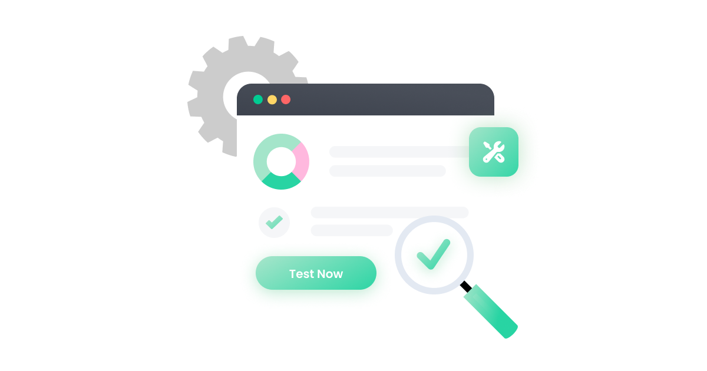

# E2E

[Home](../../../Readme.md) / [Unit Testing](../../unit-testing.md) / [Cypress](../cypress.md) / [E2E](tool.md)

E2E Testing is a technique that tests your app from the web browser through to the back end of your application, as well as testing integrations with third-party APIs and services. These types of tests are great at making sure your **entire app** is functioning as a cohesive whole.

- [Benefits](https://docs.cypress.io/guides/core-concepts/testing-types#Benefits-of-end-to-end-tests)
- [Considerations](https://docs.cypress.io/guides/core-concepts/testing-types#Considerations-for-end-to-end-tests)
- [Common senarios](https://docs.cypress.io/guides/core-concepts/testing-types#Common-scenarios-for-end-to-end-tests)

## Writing the test

There are 3 phases: 
1. **Arrange** -- set up the application state
2. **Act** -- take an action
3. **Assert** -- make an assertion about the resulting application state

- [Cypress commands](https://docs.cypress.io/api/table-of-contents)
    - [Queries](https://docs.cypress.io/api/table-of-contents#Queries)
    - [Assertions](https://docs.cypress.io/api/table-of-contents#Assertions)
    - [Actions](https://docs.cypress.io/api/table-of-contents#Actions)
    - [Other](https://docs.cypress.io/api/table-of-contents#Other-Commands)

## Running the test

Cypress E2E tests are testing a real Next.js application; they require the Next.js server to be running prior to starting Cypress. Follow the steps below to run your test(s) against your production code to mimic how your application will behave:

1. Run `npm run build`
2. Run `npm run start`
3. Run `npm run cypress -- --e2e` **in another terminal window** to start Cypress and run your E2E testing suite

## Example

Intention:
1. Visit: `https://example.cypress.io`
2. Find the element with content: `type`
3. Click on it
4. Get the URL
5. Assert it includes: `/commands/actions`
6. Get the input with the `action-email` data-testid
7. Type `fake@email.com` into the input
8. Assert the input reflects the new value

Implementation:
```
describe('My First Test', () => {
  it('Gets, types and asserts', () => {
    cy.visit('https://example.cypress.io')

    cy.contains('type').click()

    // Should be on a new URL which
    // includes '/commands/actions'
    cy.url().should('include', '/commands/actions')

    // Get an input, type into it
    cy.get('.action-email').type('fake@email.com')

    //  Verify that the value has been updated
    cy.get('.action-email').should('have.value', 'fake@email.com')
  })
})
```